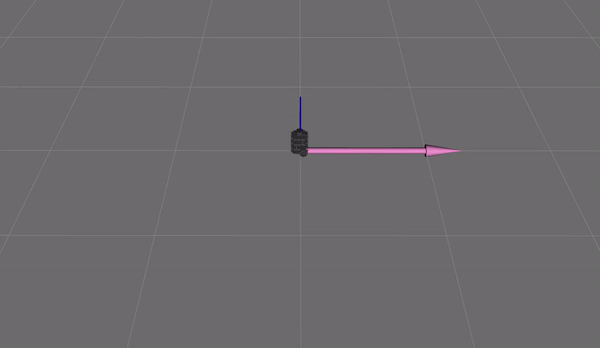

# Rigid2D
This package contains two libraries: 1) `rigid2D`, 2) `diff_drive` and several nodes that utilize these libraries.

## rigid2D library
### Overview
This library handles transformations in SE(2). This library contains the following:
* `Vector2D` - a struct that contains an `x` and `y` component. Functionalities include normalizing, getting the magnitude and angle, and basic operators.
* `Transform2D` - a class that contains a rigid body transformation in 2 dimensions. Functionalities include applying the transformation to a `Vector2D`, inverting the transform, converting a `Twist2D` to a different frame using the adjoint, and basic operators.
* `Twist2D` - a struct that contains x-velocity `dx`, y-velocity `dy`, and angular velocity `dth` components.

### Main Implementation
Running the following executable,
```
./rigid2d
```
will result in a program that promps the user to enter a series of transforms, vectors, twists, and frames. The result will be several calculations that represent the functionalities of the structs and classes that are contained in the library.

## diff_drive library
### Overview
This library models the kinematics of a differential drive robot with a given wheel base and wheel radius. This allows the mathematical calculations to be handled without tying in to a speific robot or control scheme. This library contains the following:
* `wheelVel` - a struct that contains the left and right wheel velocities.
* `DiffDrive` - a class that contains the (x,y,th) configuration of the differential drive robot, the distance between the wheels, the radius of the wheels, and the angle of the left and right wheels. Functionalities include converting a `Twist2D` to the corresponding `wheelVel`, getting a `Twist2D` from updated angles of the left and right wheels, updating the configuration of the robot given updated wheel angles, and changing the configuration of the robot to a different (x,y) location.

## Catch2 Testing
Running the following executable,
```
./tests
```
implement unit tests using the `catch2` framework. It will display the number of tests ran and tests passed.

## Package Overview
The following nodes are available within this package:
* `odometer` - this node uses the `DiffDrive` class and `JointState` messages to publish `Odometry` messages in a standard ROS way.
* `fake_turtle` - this node simulates the kinematics of a differential drive robot by subscribing to the `cmd_vel` topic and publishing the corresponding `JointState` messages for the left and right wheels.

## Usage## Overview
The following nodes are available within this package:
* `odometer` - this node uses the `DiffDrive` class and `JointState` messages to publish `Odometry` messages in a standard ROS way.
* `fake_turtle` - this node simulates the kinematics of a differential drive robot by subscribing to the `cmd_vel` topic and publishing the corresponding `JointState` messages for the left and right wheels.

## Usage
Use the following command to start the `turtlebot3_teleop_keyboard` which allows you to drive the `fake_turtle` node in `rviz`. The `odometer` node will compute the odometry of the simulated turtle.
```
roslaunch rigid2d fake_turtle_odom.launch
```
Running this command should result in the following,

